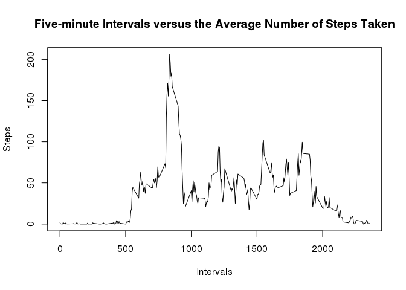
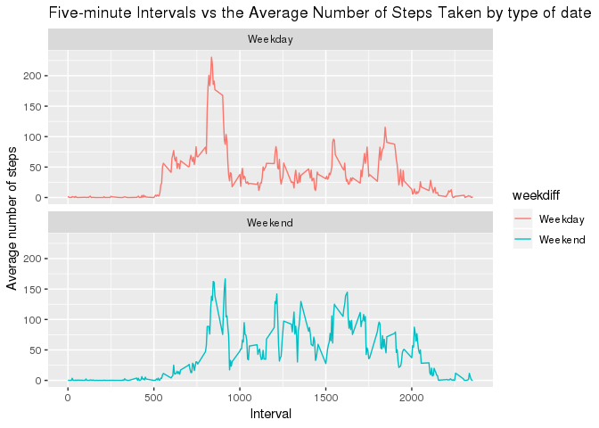

## Loading and preprocessing the data

```r
library(dplyr)
```

```
## 
## Attaching package: 'dplyr'
```

```
## The following objects are masked from 'package:stats':
## 
##     filter, lag
```

```
## The following objects are masked from 'package:base':
## 
##     intersect, setdiff, setequal, union
```

```r
library(ggplot2)

activity  <- read.csv("activity.csv")
activity$date <- gsub("/", "-", activity$date)
activity$datetime <- as.POSIXct(activity$date, format="%m-%d-%Y")
activity$day <- weekdays(as.Date(activity$date, format = "%m-%d-%Y"))

clean <- activity[!is.na(activity$steps),]
```

## What is mean total number of steps taken per day?

```r
sumTable <- aggregate(activity$steps ~ activity$date, FUN=sum, )

colnames(sumTable)<- c("Date", "Steps")
hist(sumTable$Steps, main = "Total Number of Steps Taken per Day", xlab = "Steps")
```

<!-- -->

```r
sum(sumTable$Steps)
```

```
## [1] 570608
```

```r
mean(sumTable$Steps)
```

```
## [1] 10766.19
```

```r
median(sumTable$Steps)
```

```
## [1] 10765
```
### The mean total number of steps taken per day is 10766.19 and the median total number of steps taken per day is 10765

## What is the average daily activity pattern?


```r
intervalsteps <- aggregate(steps ~ interval, data = activity, mean)


plot(intervalsteps$interval, intervalsteps$steps, type = "l", main = "Five-minute Intervals versus the Average Number of Steps Taken", xlab = "Intervals", ylab = "Steps")
```

<!-- -->

```r
maxinterval <- intervalsteps[which.max(intervalsteps$steps),]
maxinterval
```

```
##     interval    steps
## 104      835 206.1698
```

### The 5 minute interval, on average across all the days in the dataset, that contains the maximum number of steps is interval 835 with a maximum number of steps of 206.1698


## Imputing missing values

```r
sum(is.na(activity$steps))
```

```
## [1] 2304
```

```r
imputeactivity  <-  activity

naimput  <- is.na(imputeactivity$steps)

averageinterval <- tapply(clean$steps, clean$interval, mean, na.rm=TRUE, simplify=T)
imputeactivity$steps[naimput] <- averageinterval[as.character(imputeactivity$interval[naimput])]

imputeintervalsteps <- aggregate(steps ~ interval, data = imputeactivity, mean)

sumTable2 <- aggregate(imputeactivity$steps ~ imputeactivity$date, FUN=sum, )

colnames(sumTable2)<- c("Date", "Steps")
hist(sumTable2$Steps, main = "Imputed Number of Steps Taken Each Day", xlab = "Steps")
```

<!-- -->

```r
sum(sumTable2$Steps)
```

```
## [1] 656737.5
```

```r
meanimpute <- mean(sumTable2$Steps)

meanimpute
```

```
## [1] 10766.19
```

```r
medianimpute <- median(sumTable2$Steps)

medianimpute
```

```
## [1] 10766.19
```
### 1. The total number of rows with NAs is 2304. 
### 2. The strategy I used was to take the mean for the 5 minute interval across the multiple days.
### 4. The imputed mean is 10766.19 and the imputed median is 10766.19. The impact of imputing a missing value is 0 for the mean and 1.19 for the median. The total number of steps increase between the imputed and non-imputed values.

## Are there differences in activity patterns between weekdays and weekends?


```r
imputeactivity$weekdiff <- ifelse(imputeactivity$day %in% c("Saturday", "Sunday"), "Weekend","Weekday")

imputeintervalsteps <- aggregate(steps ~ interval + weekdiff, data = imputeactivity, mean)


plot<- ggplot(imputeintervalsteps, aes(x = interval , y = steps, color = weekdiff)) +
       geom_line() +
       labs(title = "Five-minute Intervals vs the Average Number of Steps Taken by type of date", x = "Interval", y = "Average number of steps") +
       facet_wrap(~weekdiff, ncol = 1, nrow=2)
print(plot)
```

<!-- -->


###  According to the chart the average number of steps is much lower during the middle of the day during the weekday than the weekend. Also, at the beginning of the day during the weekday there is an increase in the average number of steps compared to the weekend.
